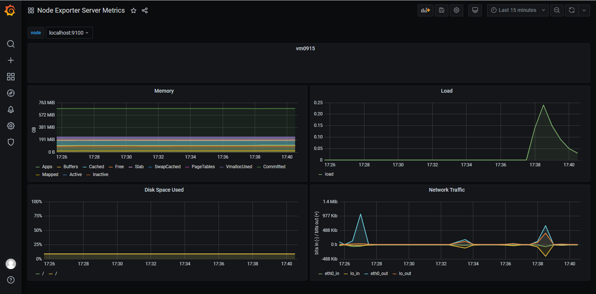

# Prometheus and Grafana 
Для выполнения ДЗ были скачены бинарные файлы этих программ. Так же скачиваем и запускаем [node_exporter](https://github.com/prometheus/node_exporter). 
Перед запуском Prometheus исправляем его [конфиг](prometheus.yml), добавляя job:
```yaml
...
  - job_name: 'node_exporter'
    static_configs:
    - targets: ['localhost:9100']
...
```
В GUI Grafana добавляем Prometheus в data source метрик.
Находим [подходящий шаблон](https://grafana.com/grafana/dashboards/405) и импортируем его в Dashboard Grafana. Изменяем шаблон под требования задания:

