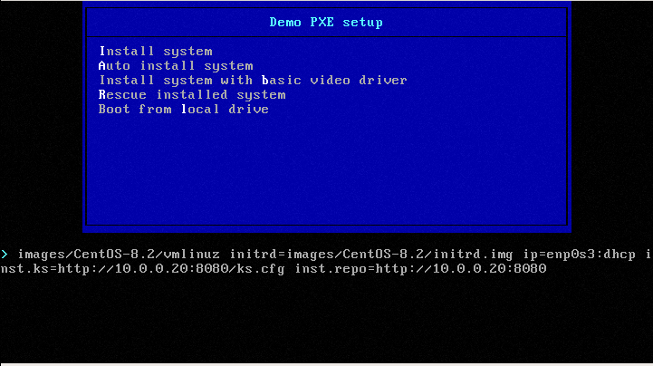
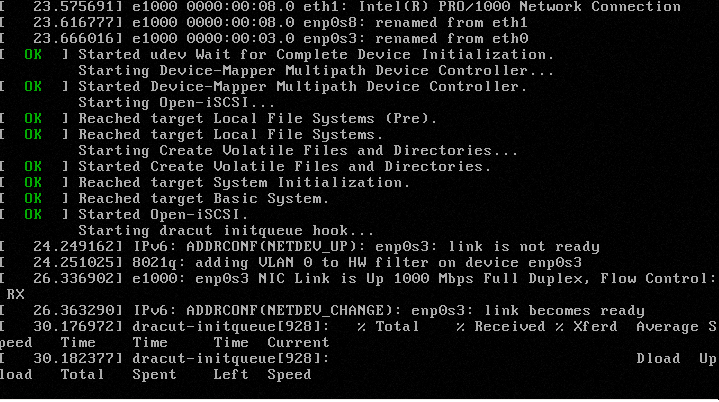
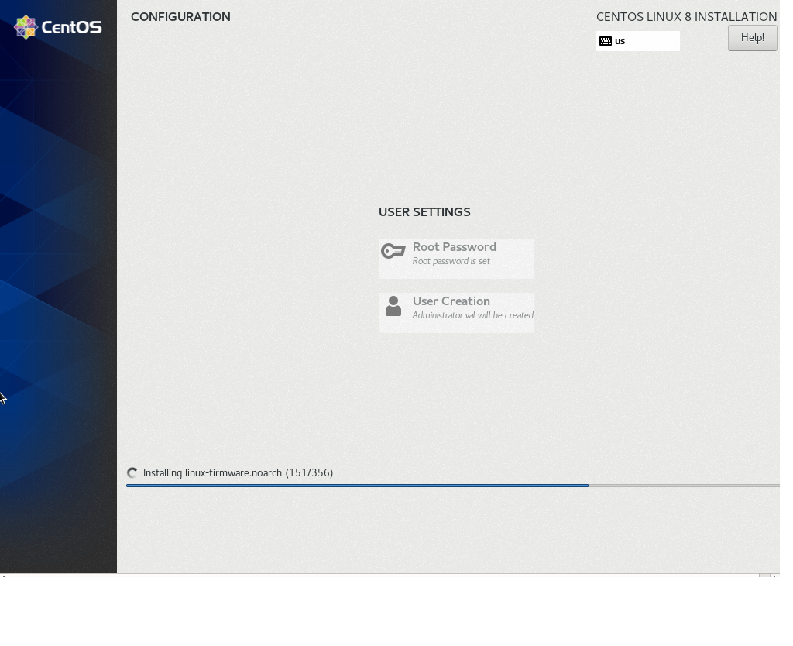

# DHCP, PXE
**Домашнее задание:**
```
Настройка PXE сервера для автоматической установки
Цель: Отрабатываем навыки установки и настройки DHCP, TFTP, PXE загрузчика и автоматической загрузки
1. Следуя шагам из документа https://docs.centos.org/en-US/8-docs/advanced-install/assembly_preparing-for-a-network-install установить и настроить загрузку по сети для дистрибутива CentOS8
В качестве шаблона воспользуйтесь репозиторием https://github.com/nixuser/virtlab/tree/main/centos_pxe
2. Поменять установку из репозитория NFS на установку из репозитория HTTP
3. Настройить автоматическую установку для созданного kickstart файла (*) Файл загружается по HTTP
* 4. автоматизировать процесс установки Cobbler cледуя шагам из документа https://cobbler.github.io/quickstart/

Критерии оценки: 1. ссылка на репозиторий github.
2. Vagrantfile с шагами установки необходимых компонентов
3. Исходный код scripts для настройки сервера (если необходимо)
4. Если какие-то шаги невозможно или сложно автоматизировать, то инструкции по ручным шагам для настройки
```

**Ход выполнения:**

В качестве шаблона воспользуемся файлами из [репозитория](https://github.com/nixuser/virtlab/tree/main/centos_pxe).

1. Для корректной работы необходимо увеличить количество оперативной памяти клиентской машины ([не менее 2048 МБ](https://bugzilla.redhat.com/show_bug.cgi?id=1314092)):
```
vb.memory = "2048"
```
2. Изменим установку с NFS на HTTP репозиторий. Для этого установим http-сервер `python3-twisted`.

Внесем изменения в скрипт, в части изменяющей файл `/var/lib/tftpboot/pxelinux/pxelinux.cfg/default`:
```
...
LABEL linux-auto
  menu label ^Auto install system
  kernel images/CentOS-8.2/vmlinuz
  append initrd=images/CentOS-8.2/initrd.img ip=enp0s3:dhcp inst.ks=http://10.0.0.20:8080/ks.cfg inst.repo=http://10.0.0.20:8080
...
```
Для более быстрой загрузки меняем ссылки на зеркала.

Собираем файлы в одной директории и раздаем по http:
```
cp /home/vagrant/cfg/ks.cfg /home/vagrant/pxe_common/
rsync -a /mnt/centos8-autoinstall/ /home/vagrant/pxe_common/
twistd  web --path /home/vagrant/pxe_common/
```

3. Запуск

Сначала запускаем и ждем полной загрузки сервера:
```
vagrant up pxeserver
```
Затем запускаем клиент:
```
vagrant up pxeclient
```
Происходит получение IP-адреса и начинается загрузка через PXE:



Выбираем нужный пункт, происходит загрузка образа и установка (в случае автоустановки):






