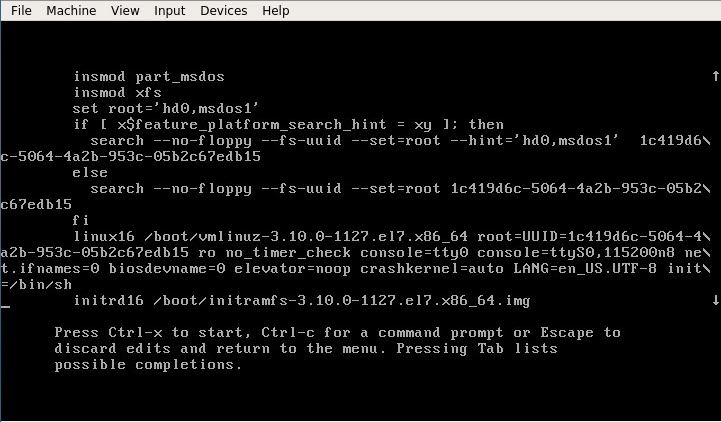
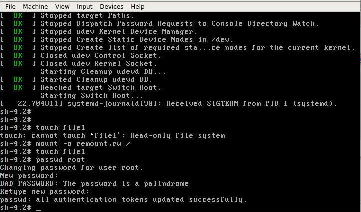
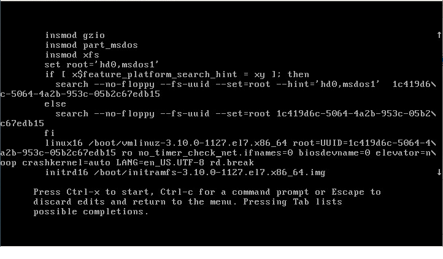
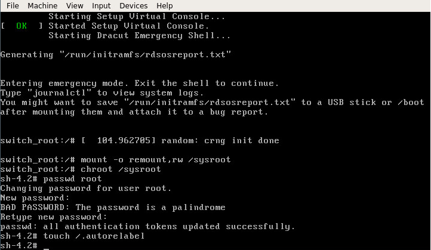
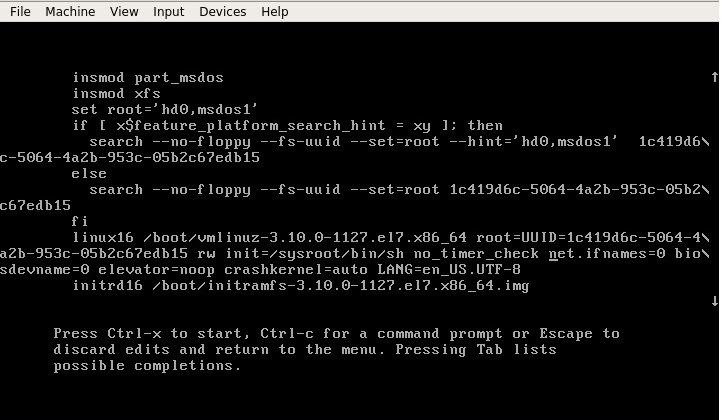
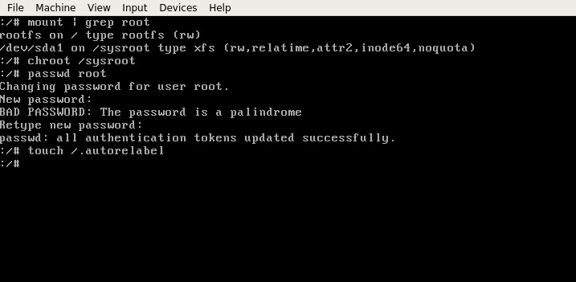
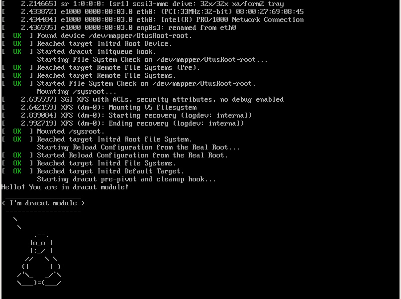

# Загрузка Linux
## Попасть в систему без пароля несколькими способами
Во время выбора ядра нажимаем 'e' и попадаем в окно для изменения параметров загрузки
### 1. init=/bin/sh
В конце строки начинающейся с **linux16** добавляем **init=/bin/sh** и нажимаем *сtrl-x* для загрузки в систему (для корректной работы с vagrant еще убираем параметры **console=tt0 console=ttyS0,115200n8**)


Рутовая файловая система примонтируется в режиме *read-only*, поэтому для внесения изменений необходимо ее перемонтировать
```bash
$ mount -o remount,rw /
$ mount | grep root
```
После чего можно убедиться, что запись возможна


### 2. rd.break
В конце строки начинающейся с **linux16** добавляем **rd.break** нажимаем *сtrl-x* для загрузки в систему


Попадаем в emergency mode. Наша корневая файловая система смонтирована в режиме *read-only*, но мы не в ней.
Примонтируем ее в режиме *rw*, поменяем пароль администратора и добавим файл *./autorelabel*, чтобы SELinux при загрузке пересмотрел контекст.
```bash
$ mount -o remount,rw /sysroot
$ chroot /sysroot
$ passwd root
$ touch /.autorelabel
```


### 3.  rw init=/sysroot/bin/sh
В строке начинающейся с **linux16** заменим **ro** на **rw init=/sysroot/bin/sh** и нажимаем *сtrl-x* для загрузки в систему
В целом то же самое что и в прошлом примере, но файловая система сразу смонтирована в режим read-write


Применим `chroot` и поменяем пароль


## Установить систему с LVM, после чего переименовать VG
Выполнение этой части ДЗ зафиксировано в утилитой [script](typescript)
Посмотрим текущее состояние системы
```bash
$ vgs
VG         #PV #LV #SN Attr   VSize   VFree
  VolGroup00   1   1   0 wz--n- <18.00g    0 
```
Переименуем volume group
```bash
$ vgrename VolGroup00 OtusRoot
Volume group "VolGroup00" successfully renamed to "OtusRoot"
```
Далее правим */etc/fstab, /etc/default/grub, /boot/grub2/grub.cfg*. Везде заменяем старое название на новое. 
```bash
$ grub2-mkconfig --output=/boot/grub2/grub.cfg
```
Пересоздаем **initrd image**, чтобы он знал новое название Volume Group
```bash
$ mkinitrd -f -v /boot/initramfs-$(uname -r).img $(uname -r)
```
Если все успешно, то загрузка выполниться с новым именем vg
```bash
$ vgs
  VG       #PV #LV #SN Attr   VSize   VFree
  OtusRoot   1   1   0 wz--n- <18.00g    0
```

## Добавить модуль в initrd


Скрипты модулей хранятся в каталоге */usr/lib/dracut/modules.d/*. Для того чтобы добавить свой модуль создаем там папку с именем **01test**:
```bash
$ mkdir /usr/lib/dracut/modules.d/01test
```
В нее поместим два скрипта:
1. [module-setup.sh](module-setup.sh) - который устанавливает модуль и вызывает скрипт test.sh
2. [test.sh](test.sh) - собственно сам вызываемый скрипт, в нём у нас рисуется пингвинчик
Пересобираем образ **initrd**
```bash
$ mkinitrd -f -v /boot/initramfs-$(uname -r).img $(uname -r)
```
либо
```bash
$ dracut -f -v
```
Можно проверить/посмотреть какие модули загружены в образ:
```bash
$ lsinitrd -m /boot/initramfs-$(uname -r).img | grep test
test
```
После чего можно пойти двумя путями для проверки:
- Перезагрузиться и руками выключить опции **rghb** и **quiet** и увидеть вывод
- Отредактировать **grub.cfg** убрав эти опции
В итоге при загрузке будет пауза на 10 секунд и появится пингвин в выводе терминала

