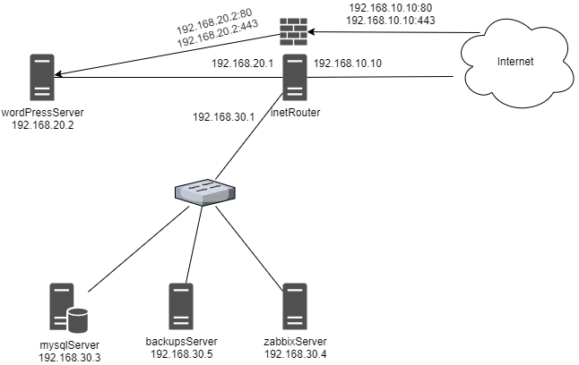

# Автоматизированная настройка стенда Wordpress с помощью Vagrant и Ansible

Цель работы:

Создание рабочего веб-проекта с развертыванием нескольких виртуальных машин.

Отвечает следующим требованиям:
- включен https
- основная инфраструктура в DMZ зоне
- firewall на входе
- мониторинг
- везде включен selinux
- организован централизованный сбор логов

# Проектная документация
Для работы стенда необходимо преварительно установить на машине с Vargrant следующие модули ansible:

```bash
ansible-galaxy collection install ansible.posix
ansible-galaxy collection install community.general
```
В зависимости от условий подключения, возможно необходимо, прописать маршруты до порта роутера стенда (192.168.10.10) через адрес хоста, на котором установлен virtualbox, а также разрешить на нем передачу пакетов между интерфейсами.
`vagrant up` поднимает виртуальные машины и соединяет их согласно следующей топологии:



Сервисы на машинах поднимаются с помощью Ansible. 

Основные компонеты ВМ:

## Общие для всех ВМ

На каждой машине добавляется репозиторий `epel-release` и устанавливается значение параметра системы `vm.swappiness = 10`.

Также ставится zabbix-агент.

## ВМ wordpressServer
Здесь устанавливаются:
- php-fpm
- nginx
- wordpress
- Клиент rsyslog

Nginx перенаправляет запросы с 80 на 443 порт для безопасного соединения.
С php-fpm общается через unix-сокет, чтобы избежать затрат на tcp.

Wordpress файлы бекапятся borgbackup.

## ВМ mysqlServer
Здесь устанавливаются:
- mariadb
- Клиент rsyslog
 
На этом серевере БД размещены базы Wordpress и Zabbix. 

С базы делается бекап mysqldump и borgbackup, вызываемые по таймеру systemd.
 
## ВМ inetRouter
Здесь решается задача передачи пакетов между портами и настраивается `iptables`: настроен проброс портов до nginx, весь остальной трафик из интернета дропается.

## ВМ backupsServer
Здесь устанавливается:
- borgbackup server
- rsyslog server

Для работы borg нужно создать ключ rsa и добавить публичный в `/home/vagrant/.ssh/authorized_keys backupsServer` и приватный на машины `wordpressServe` и `mysqlServer` в `/root/.ssh/borg`

и изменить его права
```bash
chown 600 /root/.ssh/borg
```

## ВМ zabbixServer
Здесь устанавливается:
- zabbix server
- nginx

Подключение к Zabbix происходит через отдельный адрес (https://192.168.40.10) проброшеный в хостовую систему, так как по задумке доступ из вне (кроме как к nginx) ограничен роутером. 

После поднятия стенда Zabbix-сервер необходимо сконфигурировать вручную в веб интерфейсе.

Дефолтные учетные данные: `Admin/zabbix`

Так как агенты уже установлены и сконфигурированны на хостах это можно легко сделать с помощью правил Discovery и Discovery action.

### Восстановление mysql из бекапа:

1. Добавить ключ от borg
2. Скопировать бекап на сервер
```bash
BORG_PASSPHRASE="otus" BORG_RSH="ssh -o 'StrictHostKeyChecking=no' -i /root/.ssh/borg" borg list vagrant@192.168.30.5:/backups/mysql

BORG_PASSPHRASE="otus" BORG_RSH="ssh -o 'StrictHostKeyChecking=no' -i /root/.ssh/borg" borg extract vagrant@192.168.30.5:/backups/mysql::2021-01-26-19-30
```
3. Восстановить базы
```bash
mysql -u root -p < var/lib/mysql/backup/all_databases.sql
```
